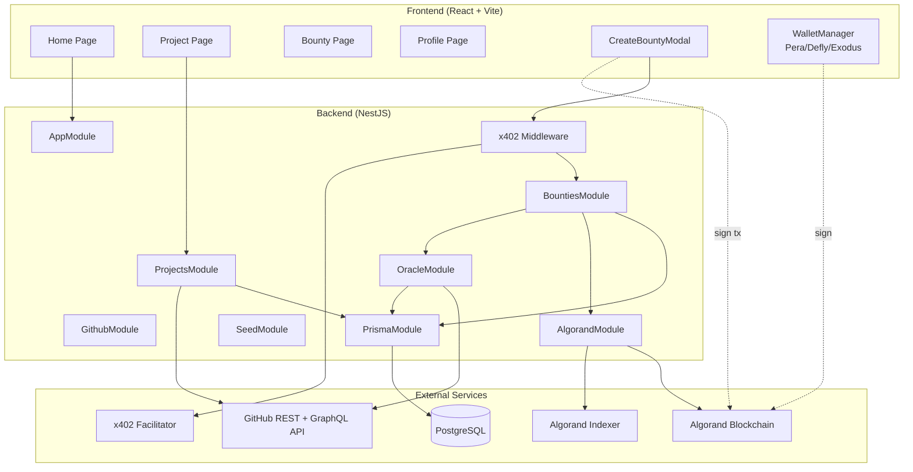

# AUDIT_REPORT.md — WeSource Bounty Marketplace

**Auditor**: The Forensic Architect
**Date**: 2026-03-28
**Codebase**: Monorepo `/contracts`, `/server`, `/client`
**Scope**: Bounty Lifecycle — 5 core flows + cross-cutting concerns

---

## Section 1: System Inventory (The Map)

### 1.1 Project Summary

WeSource is a decentralized open-source bounty platform on Algorand. Users register GitHub projects, create bounties for issues, and an automated oracle verifies solver contributions via the GitHub API. Funds are held in on-chain escrow via a SourceFactory smart contract and released to verified winners.

### 1.2 Architecture Diagram



### 1.3 Smart Contract Methods

| Method | Signature | Access | Parameters | Description |
|--------|-----------|--------|------------|-------------|
| `bootstrap` | `bootstrap()void` | Manager only (first call) | — | Sets MANAGER_ADDRESS to Txn.sender |
| `create_bounty` | `create_bounty(uint64,uint64)void` | Any caller | bounty_id, bounty_total_value (microAlgos) | Creates box record, increments TOTAL_BOUNTIES |
| `withdraw_bounty` | `withdraw_bounty(uint64,address)void` | Manager only | bounty_id, winner address | Marks bounty paid, sends inner payment to winner |

**Storage Schema:**
- Global: `MANAGER_ADDRESS` (Account), `TOTAL_BOUNTIES` (uint64)
- Box: `b__` + 8-byte bounty_id → BountyDataType { bounty_total_value: uint64, bounty_paid: bool, winner: address }

### 1.4 Backend API Routes

| Method | Path | Auth | Module | Purpose |
|--------|------|------|--------|---------|
| GET | `/` | None | AppController | Health check |
| POST | `/projects` | None | ProjectsController | Create project with repo URLs |
| GET | `/projects` | None | ProjectsController | List all projects |
| GET | `/projects/:id` | None | ProjectsController | Get project + live GitHub data |
| DELETE | `/projects/:id` | None | ProjectsController | Delete project (cascade) |
| POST | `/api/bounties` | x402 (optional) | BountiesController | Create bounty record |
| GET | `/api/bounties` | None | BountiesController | List all bounties |
| GET | `/api/bounties/winner/:username` | None | BountiesController | Get bounties won by user |
| POST | `/api/bounties/claim` | None | BountiesController | Claim bounty (winner) |
| POST | `/api/bounties/sync` | None | BountiesController | Sync from on-chain state |
| POST | `/oracle/validate` | None | OracleController | Trigger oracle validation |
| GET | `/oracle/status` | None | OracleController | Oracle health check |
| POST | `/seed` | None | SeedController | Seed demo data |

### 1.5 Frontend Pages/Views

| Route | Component | Key Functionality |
|-------|-----------|-------------------|
| `/` | Home | Project/bounty explorer, create project form |
| `/project/:projectId` | ProjectPage | Project details, GitHub issues, create bounty |
| `/bounty/:bountyId` | BountyPage | Bounty details, claim button, GitHub link |
| `/profile/:walletAddress` | ProfilePage | User profile (hardcoded zeros — non-functional) |

### 1.6 Module Dependencies

```mermaid
flowchart LR
    BountiesModule --> GithubModule
    BountiesModule --> AlgorandModule
    BountiesModule --> OracleModule
    OracleModule --> PrismaModule
    OracleModule --> GithubModule
    ProjectsModule --> PrismaModule
    ProjectsModule --> GithubModule
    AlgorandModule -.->|@Global| BountiesModule
    AlgorandModule -.->|@Global| AppModule
```

---

## Section 2: Findings Ledger (The Evidence)

### CRITICAL

---

### [🔴 CRITICAL] F-1: Contract `create_bounty` has no access control

**Flow**: 3 (Bounty Creation)
**Risk**: Any caller can front-run bounty creation, creating a box record with arbitrary data before the legitimate creator does. The legitimate creator's subsequent `create_bounty` call will fail with "Bounty already exists".
**Files**:
- `contracts/smart_contracts/source_factory/contract.algo.ts` (lines 27–37)

**Observation**:
```ts
public create_bounty(bounty_id: uint64, bounty_total_value: uint64) {
    assert(bounty_total_value > 0, 'Bounty value must be > 0')
    const bounty = this.bounties(new BountyIdType({ bounty_id: new arc4.Uint64(bounty_id) }))
    assert(!bounty.exists, 'Bounty already exists')
    // ... creates record
}
```
No sender verification. Any account can call this with any `bounty_id`.

**Expected Behavior**: The contract should verify that the caller is authorized — either the manager/backend or that the caller has deposited matching funds. The `create_bounty` method should either require manager-only access or verify that a payment of `bounty_total_value` was made in the same atomic group.

**Recommendation**: Add `assert(Txn.sender === this.MANAGER_ADDRESS.value, 'Only manager')` or verify the grouped payment transaction amount matches `bounty_total_value`.

---

### [🔴 CRITICAL] F-2: No fund deposit verification in `create_bounty`

**Flow**: 3 (Bounty Creation)
**Risk**: A user can create a bounty record claiming 1000 ALGO escrow while only depositing 1 ALGO. The DB and on-chain box will show inflated amounts.
**Files**:
- `contracts/smart_contracts/source_factory/contract.algo.ts` (lines 27–37)
- `client/src/services/bountyContract.ts` (lines 124–141)

**Observation**:
The frontend sends a grouped payment + app call:
```ts
.addPayment({ sender: senderAddress, receiver: appAddress, amount: totalPayment })
.addAppCallMethodCall(await appClient.params.createBounty({...}))
```
But the contract's `create_bounty` never checks `op.balance()` or verifies the payment transaction exists in the group. It blindly stores whatever `bounty_total_value` is passed.

**Expected Behavior**: The contract should verify that the application account's balance increased by at least `bounty_total_value` (or verify the payment transaction in the group via `gtxn`). This ensures the stored value matches actual deposited funds.

**Recommendation**: Add `assert(op.balance(Global.currentApplicationAddress) >= bounty_total_value, 'Insufficient deposit')` or verify the grouped payment via `gtxn` amount.

---

### [🔴 CRITICAL] F-3: Double-hash mismatch — bountyKey vs bountyId

**Flow**: Cross-cutting (affects all flows)
**Risk**: The DB `bountyKey` (SHA256) and the on-chain `bountyId` (djb2) are different values for the same logical bounty. Sync and lookup operations must recompute the correct hash.
**Files**:
- `server/src/bounties/bounties.service.ts` (lines 393–406) — `computeBountyId` = djb2
- `server/src/bounties/bounties.service.ts` (lines 532–538) — `buildBountyKey` = SHA256
- `client/src/services/bountyContract.ts` (lines 14–27) — `computeBountyId` = djb2

**Observation**:
```ts
// djb2 (on-chain bountyId)
private computeBountyId(repoOwner, repoName, issueNumber): bigint {
    // djb2 hash algorithm
    let hash = BigInt(5381);
    // ...
}

// SHA256 (off-chain bountyKey)
private buildBountyKey(repoOwner, repoName, issueNumber): string {
    return createHash('sha256').update(canonical, 'utf8').digest('hex');
}
```
These produce completely different values for the same input. The `syncFromChain` method must iterate all DB bounties and recompute djb2 for each to match on-chain boxes.

**Expected Behavior**: Both layers should use the same hash algorithm. The on-chain bountyId should match the off-chain bountyKey, or the off-chain bountyKey should be derived from the on-chain bountyId.

**Recommendation**: Standardize on one hash algorithm. Use djb2 everywhere (matching the contract) or switch the contract to accept a pre-computed hash.

---

### HIGH

---

### [🟠 HIGH] F-4: Bounty amount type mismatch — Float vs uint64 vs number

**Flow**: 3 (Bounty Creation)
**Risk**: The DB stores amounts in ALGO (Float), the contract stores in microAlgos (uint64). Comparisons during sync will be wrong by a factor of 1,000,000.
**Files**:
- `server/prisma/schema.prisma` (line 39) — `amount Float`
- `server/src/bounties/dto/create-bounty.dto.ts` (line 23) — `amount: number`
- `client/src/services/bountyContract.ts` (line 32) — `algoToMicroAlgo(algoAmount * 1_000_000)`
- `contracts/smart_contracts/source_factory/contract.algo.ts` (line 27) — `bounty_total_value: uint64`

**Observation**:
- Frontend: user enters "10" ALGO → `algoToMicroAlgo(10)` = `10000000n` microAlgos → sent to contract
- Backend: `POST /api/bounties` with `amount: 10` → stored as Float `10` in DB
- Contract: stores `10000000` as uint64
- Sync comparison: `10 (DB)` vs `10000000 (chain)` → mismatch

**Expected Behavior**: All layers should use microAlgos (uint64) as the canonical unit, matching the contract. The DB should store `BigInt` or `Int` in microAlgos.

**Recommendation**: Change Prisma schema to `amount BigInt` and store microAlgos. Add ALGO→microAlgo conversion at the API boundary (DTO or service).

---

### [🟠 HIGH] F-5: `withdraw_bounty` passes string where contract expects Account

**Flow**: 5 (Fund Withdrawal)
**Risk**: Transaction may fail or produce unexpected results if the ARC-56 client doesn't auto-convert the address string.
**Files**:
- `server/src/algorand/algorand.service.ts` (line 161) — `args: [bountyId, winnerWallet]`
- `contracts/smart_contracts/source_factory/contract.algo.ts` (line 39) — `winner: Account`

**Observation**:
```ts
// Backend passes string
const result = await appClient.send.call({
    method: 'withdraw_bounty',
    args: [bountyId, winnerWallet],  // winnerWallet is string
    boxReferences: [{ appId: this.appId, name: boxKey }],
});
```
The contract expects `Account` type. The ARC-56 client generated types show `winner: string` in the client args, suggesting the ABI encoding handles this, but the contract source uses `Account` which is a value type in Algorand TypeScript.

**Expected Behavior**: The ARC-56 app spec should define the winner parameter as `address` (ABI type), not `Account` (AVM type). Verify the generated app spec matches.

**Recommendation**: Verify the ARC-56 spec's method signature. If `winner` is encoded as `address`, this works. If it's `Account`, the call will fail.

---

### [🟠 HIGH] F-6: No on-chain refund mechanism

**Flow**: 5 (Fund Withdrawal)
**Risk**: If a bounty is never claimed (issue closed as "not_planned", or no solver found), funds are permanently locked in the contract. The DB has `REFUNDABLE` status but no on-chain path exists.
**Files**:
- `contracts/smart_contracts/source_factory/contract.algo.ts` — only `create_bounty` and `withdraw_bounty`
- `server/prisma/schema.prisma` (line 83) — `REFUNDABLE` status defined
- `server/src/oracle/oracle.service.ts` (lines 245–265) — marks bounties REFUNDABLE

**Observation**:
The oracle marks bounties as `REFUNDABLE` in the DB when issues are closed as "not_planned", but the contract has no `refund_bounty` or `reclaim_bounty` method. There is no way for the creator to get their funds back.

**Expected Behavior**: The contract should have a `refund_bounty(bounty_id: uint64)` method callable by the manager (or the original creator after a deadline). This would send an inner payment back to the creator and mark the bounty as refunded.

**Recommendation**: Add a `refund_bounty` method to the contract that sends the escrowed funds back to a specified address (manager-authorized or creator-authorized with deadline).

---

### [🟠 HIGH] F-7: Oracle has no on-chain authorization

**Flow**: 4 (Oracle Verification)
**Risk**: The oracle (backend) decides who gets paid based entirely on off-chain GitHub verification. Anyone with the `MANAGER_MNEMONIC` can withdraw any bounty to any address. There's no on-chain proof that the winner actually solved the issue.
**Files**:
- `server/src/algorand/algorand.service.ts` (line 109) — manager from mnemonic
- `server/src/bounties/bounties.service.ts` (lines 123–205) — claim flow

**Observation**:
The claim flow: user calls `POST /api/bounties/claim` → backend verifies GitHub identity (off-chain DB) → backend calls `withdraw_bounty` on-chain as the manager. The contract only checks `Txn.sender === MANAGER_ADDRESS`. It doesn't verify the winner's identity or that the issue was actually solved.

**Expected Behavior**: The contract should accept the winner's address only if the oracle can provide proof (e.g., signed attestation, or the winner calls a `claim` method themselves after the oracle sets their address on-chain). The current model is a fully custodial system disguised as decentralized escrow.

**Recommendation**: Consider a two-step process: (1) oracle calls `authorize_winner(bounty_id, winner_address)` to set the winner on-chain, then (2) the winner calls `claim(bounty_id)` to receive funds. This ensures only the authorized winner can claim.

---

### MEDIUM

---

### [🟡 MEDIUM] F-8: BountyPage "Claim Bounty" button shown for OPEN bounties

**Flow**: 5 (Fund Withdrawal) — UX issue
**Risk**: Users see a "Claim Bounty" button on OPEN bounties. Clicking it will hit the claim endpoint which rejects non-READY_FOR_CLAIM bounties.
**Files**:
- `client/src/pages/BountyPage.tsx` (lines 223–232)

**Observation**:
```tsx
{isOpen && isConnected ? (
  <button className="...">Claim Bounty</button>
) : isOpen ? (
  <div>Connect your account to claim this bounty</div>
) : (
  <div>This bounty has been claimed</div>
)}
```
The button shows for `isOpen` (status === 'OPEN'), but the claim endpoint requires `READY_FOR_CLAIM`.

**Expected Behavior**: The button should only appear when `status === 'READY_FOR_CLAIM'`. For OPEN bounties, show "Solve this issue on GitHub" or similar guidance.

**Recommendation**: Change condition to `bounty.status === 'READY_FOR_CLAIM' && isConnected`.

---

### [🟡 MEDIUM] F-9: No authentication on any API endpoint

**Flow**: Cross-cutting
**Risk**: Anyone can create projects, create bounties, delete projects, trigger oracle validation, and seed the database. No identity verification.
**Files**:
- `server/src/bounties/bounties.controller.ts` — no guards
- `server/src/projects/projects.controller.ts` — no guards
- `server/src/oracle/oracle.controller.ts` — no guards
- `server/src/main.ts` — no auth guards applied globally

**Observation**:
No `@UseGuards()` decorators on any controller. No JWT validation, no API key check, no wallet signature verification. The docs state "Public endpoints (MVP)" but this is a significant gap.

**Expected Behavior**: At minimum, mutating operations (POST, DELETE) should require authentication. Wallet signature verification or JWT from Web3Auth would be appropriate.

**Recommendation**: Implement an auth guard that verifies the caller's identity (wallet signature or Web3Auth JWT) for write operations.

---

### [🟡 MEDIUM] F-10: On-chain sync may parse box data incorrectly

**Flow**: 4 (Oracle Verification), 5 (Fund Withdrawal) — sync concern
**Risk**: Manual struct parsing assumes a specific byte layout that may not match ARC-4 ABI encoding.
**Files**:
- `server/src/algorand/algorand.service.ts` (lines 207–224)

**Observation**:
```ts
const totalValue = boxValue.readBigUInt64BE(0);   // bytes 0-7
const isPaid = boxValue[8] !== 0;                   // byte 8
const winnerBytes = boxValue.subarray(9, 41);       // bytes 9-40
```
This assumes contiguous binary layout. ARC-4 ABI encoding may add length prefixes, alignment bytes, or use different endianness for complex types.

**Expected Behavior**: Use the ARC-56 client's built-in state decoding instead of manual byte parsing. The `SourceFactoryClient` has `state.box.bounties.getMap()` and `state.box.bounties.value()` methods.

**Recommendation**: Replace manual parsing with `appClient.state.box.bounties.getMap()` or use the generated client's decoding methods.

---

### [🟡 MEDIUM] F-11: Hardcoded method selector for indexer queries

**Flow**: 4 (Oracle Verification) — sync concern
**Risk**: If the contract is recompiled with changes, the ARC-4 method selector may change, silently breaking transaction lookup.
**Files**:
- `server/src/algorand/algorand.service.ts` (line 300)

**Observation**:
```ts
const createBountySelector = Buffer.from([0x2c, 0x5b, 0x7f, 0x85]); // Pre-computed selector
```
This is a hardcoded 4-byte selector. The comment says "Pre-computed selector" but there's no validation that it matches the current contract.

**Expected Behavior**: Compute the selector dynamically from the method signature `create_bounty(uint64,uint64)void` using SHA-512/256, or read it from the ARC-56 app spec.

**Recommendation**: Derive the selector from the app spec's method definitions at runtime.

---

### [🟡 MEDIUM] F-12: `githubIssueId` always set to BigInt(0)

**Flow**: 1 (Project Registration) — data integrity
**Risk**: The GitHub issue global ID is never populated, making it impossible to correlate bounties with GitHub issues by internal ID.
**Files**:
- `server/src/bounties/bounties.service.ts` (line 71)

**Observation**:
```ts
const bounty = await this.prisma.bounty.create({
    data: {
        // ...
        githubIssueId: BigInt(0), // Always zero
    },
});
```

**Expected Behavior**: Fetch the GitHub issue's global node ID when creating the bounty, or populate it during oracle validation.

**Recommendation**: Remove the field if unused, or populate it during bounty creation via the GitHub API.

---

### LOW

---

### [🟢 LOW] F-13: `console.log` in production oracle code

**Flow**: 4 (Oracle Verification)
**Files**:
- `server/src/oracle/oracle.service.ts` (line 120) — `console.log('Bounty data', bounty)`

**Observation**: Leaks bounty data including wallet addresses to stdout.

**Recommendation**: Remove or replace with `this.logger.debug()`.

---

### [🟢 LOW] F-14: Silent error swallowing in `getOnChainBounty`

**Flow**: Cross-cutting
**Files**:
- `server/src/algorand/algorand.service.ts` (lines 265–267)

**Observation**:
```ts
catch {
    return null;
}
```
All errors (network, permission, parsing) are silently swallowed.

**Recommendation**: Log the error before returning null.

---

### [🟢 LOW] F-15: Profile page is non-functional

**Flow**: N/A — UI
**Files**:
- `client/src/pages/ProfilePage.tsx` (lines 42–53)

**Observation**: All stats (Projects, Bounties, Wins) are hardcoded to 0. No API call fetches user data.

**Recommendation**: Implement data fetching or remove the page.

---

### [🟢 LOW] F-16: `winnerId` type mismatch between DB and response

**Flow**: 4 (Oracle Verification), 5 (Fund Withdrawal)
**Files**:
- `server/prisma/schema.prisma` (line 48) — `winnerId Int?`
- `server/src/bounties/dto/bounty-response.dto.ts` (line 34) — `winnerId: number | null`

**Observation**: Minor — types are consistent (Int ↔ number). But the `winnerId` is a DB auto-increment ID, not a GitHub ID or wallet address. The frontend has no way to resolve this to a user identity.

**Recommendation**: Include `winnerGithubUsername` or `winnerWallet` in the response DTO.

---

### [🟢 LOW] F-17: `console.log` in AppController

**Flow**: N/A
**Files**:
- `server/src/app.controller.ts` (line 10) — `console.log('gethELLO')`

**Observation**: Debug log left in production code.

**Recommendation**: Remove.

---

## Section 3: Type Consistency Matrix

| Data Field | Contract (Source of Truth) | Backend (Prisma/DTO) | Frontend (api.ts) | Status |
|---|---|---|---|---|
| Bounty Amount | `uint64` (microAlgos) | `Float` (ALGO) | `number` (ALGO) | ❌ F-4 |
| Bounty ID | `uint64` (djb2 hash) | `Int` (autoincrement) | `number` (DB id) | ❌ F-3 |
| Bounty Key | N/A | `String` (SHA256) | `string` | ⚠️ Not on-chain |
| Status | `bool` paid + `address` winner | Enum (OPEN/READY/CLAIMED/REFUNDABLE) | `string` | ⚠️ Implicit mapping |
| Winner Address | `Account` (32 bytes) | `User FK` (Int) | `number` (DB id) | ❌ Different representations |
| Creator Wallet | N/A (not stored on-chain) | `String` | `string` | ⚠️ Off-chain only |
| Issue Number | Embedded in bountyId hash | `Int` | `number` | ✅ Consistent |
| Issue URL | N/A | `String @unique` | `string` | ✅ Consistent |
| GitHub Issue ID | N/A | `BigInt` (always 0) | N/A | ❌ F-12 |
| Timestamps | N/A (no on-chain time) | `DateTime` | `string` (ISO) | ✅ Consistent |
| Manager Address | `Account` (GlobalState) | N/A | N/A | ✅ Contract-only |
| App Balance | `op.balance()` | N/A | `bigint` (getAppBalance) | ✅ Read-only |

**Status Legend:**
- ✅ Aligned — types match or conversion is explicit and correct
- ⚠️ Implicit conversion — works but fragile
- ❌ Mismatch — types conflict or conversion is missing/incorrect

---

## Section 4: Priority Roadmap

| Priority | ID | Title | Effort | Impact | Flow |
|----------|-----|-------|--------|--------|------|
| 🔴 P0 — Do Now | F-1 | Add access control to `create_bounty` in contract | S | Critical | 3 |
| 🔴 P0 — Do Now | F-2 | Add fund deposit verification in `create_bounty` | M | Critical | 3 |
| 🔴 P0 — Do Now | F-3 | Standardize bounty ID hash (djb2 everywhere or SHA256 everywhere) | M | Critical | Cross |
| 🟠 P1 — This Sprint | F-4 | Change Prisma `amount` from Float to BigInt (microAlgos) | S | High | 3 |
| 🟠 P1 — This Sprint | F-5 | Verify ARC-56 spec encoding for `withdraw_bounty` winner param | S | High | 5 |
| 🟠 P1 — This Sprint | F-6 | Add `refund_bounty` method to contract + backend integration | L | High | 5 |
| 🟠 P1 — This Sprint | F-7 | Implement two-step winner authorization (oracle sets winner, winner claims) | L | High | 4 |
| 🟡 P2 — Next Sprint | F-8 | Fix BountyPage claim button to only show for READY_FOR_CLAIM | S | Medium | 5 |
| 🟡 P2 — Next Sprint | F-9 | Add authentication guard to mutating API endpoints | M | Medium | Cross |
| 🟡 P2 — Next Sprint | F-10 | Replace manual box parsing with ARC-56 client state methods | M | Medium | 4 |
| 🟡 P2 — Next Sprint | F-11 | Derive method selector dynamically from app spec | S | Medium | 4 |
| 🟡 P2 — Next Sprint | F-12 | Populate githubIssueId during bounty creation or remove field | S | Medium | 1 |
| 🟢 P3 — Backlog | F-13 | Remove console.log from oracle service | S | Low | 4 |
| 🟢 P3 — Backlog | F-14 | Add error logging in getOnChainBounty catch block | S | Low | Cross |
| 🟢 P3 — Backlog | F-15 | Implement ProfilePage data fetching or remove page | M | Low | N/A |
| 🟢 P3 — Backlog | F-16 | Add winnerGithubUsername to bounty response DTO | S | Low | 4 |
| 🟢 P3 — Backlog | F-17 | Remove debug console.log from AppController | S | Low | N/A |

**Effort Key**: S = Small (< 1 day), M = Medium (1–3 days), L = Large (3+ days)

---

## Section 5: Secondary Observations

### x402 Protocol
The x402 payment middleware is implemented and functional for gating `POST /api/bounties`. It requires a USDC micropayment on Algorand TestNet via a remote facilitator. The frontend handles the 402-response flow with a two-phase create-and-pay UI. This is well-integrated but introduces an additional payment on top of the main bounty escrow — the x402 payment goes to `AVM_ADDRESS`, not to the escrow contract.

### AI/Agent Accessibility
API responses are JSON but lack machine-readable pagination, filtering, or HATEOAS links. Error responses use NestJS default format. Consider standardizing error codes and adding pagination metadata for programmatic consumers.

### UI/UX Polish
Loading states exist (`LoadingPair`), error boundaries are implemented, and the design uses a consistent pixelated/brutalist theme. The Profile page is non-functional (hardcoded zeros). The "Claim Bounty" button on OPEN bounties is misleading (F-8). Empty states could be improved for bounties with no winners.

### Testing & CI/CD
The contract has unit tests (`contract.algo.spec.ts`) and integration tests (`contract.e2e.spec.ts`). The backend has a test directory but it appears to contain only the default NestJS controller spec. No E2E tests for the bounty lifecycle were found. The frontend has Jest and Playwright configured but tests were not audited.

### Observability
The backend uses NestJS `Logger` for most operations but also has stray `console.log` calls (F-13, F-17). No structured logging, no request tracing, no health check endpoints beyond the root `/` handler and `/oracle/status`.

---

## Report Meta

- **Files read**: 40+ source files across `/contracts`, `/server`, `/client`, `/docs`
- **Findings**: 17 total (3 CRITICAL, 4 HIGH, 5 MEDIUM, 5 LOW)
- **Key concern**: The contract has no access control on `create_bounty` (F-1) and no fund verification (F-2) — these are exploitable today
- **Architecture gap**: The system is fully custodial — the backend manager wallet controls all withdrawals with no on-chain proof of oracle decisions
- **Type mismatch**: Bounty amounts stored as Float (ALGO) in the DB but uint64 (microAlgos) on-chain (F-4) — comparisons will be off by 1,000,000x
- **Could not audit**: Contract E2E tests were not run, frontend unit tests were not reviewed, deployment pipeline was not verified
