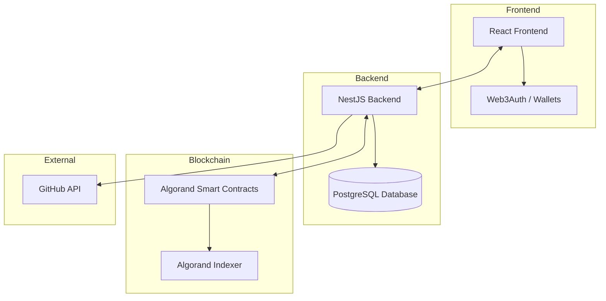
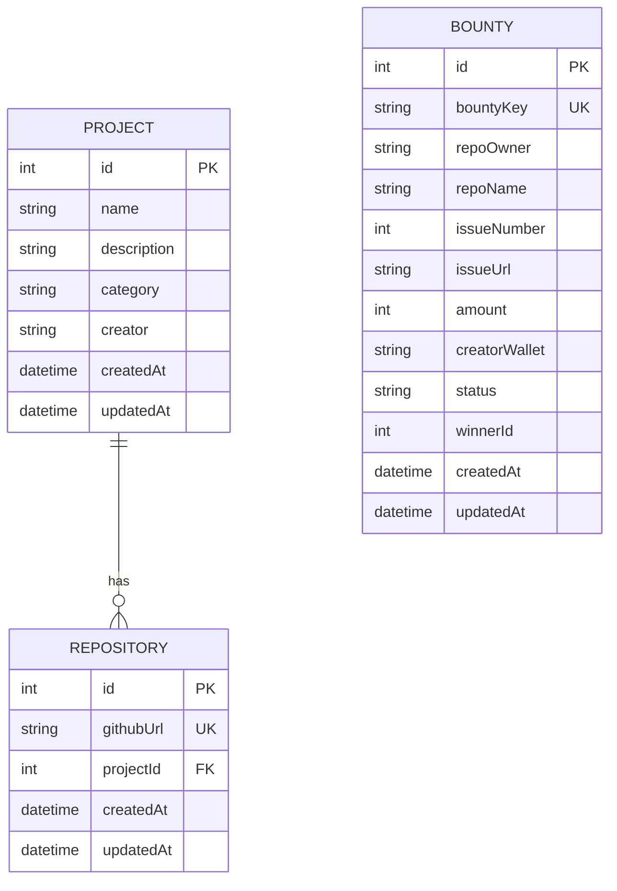
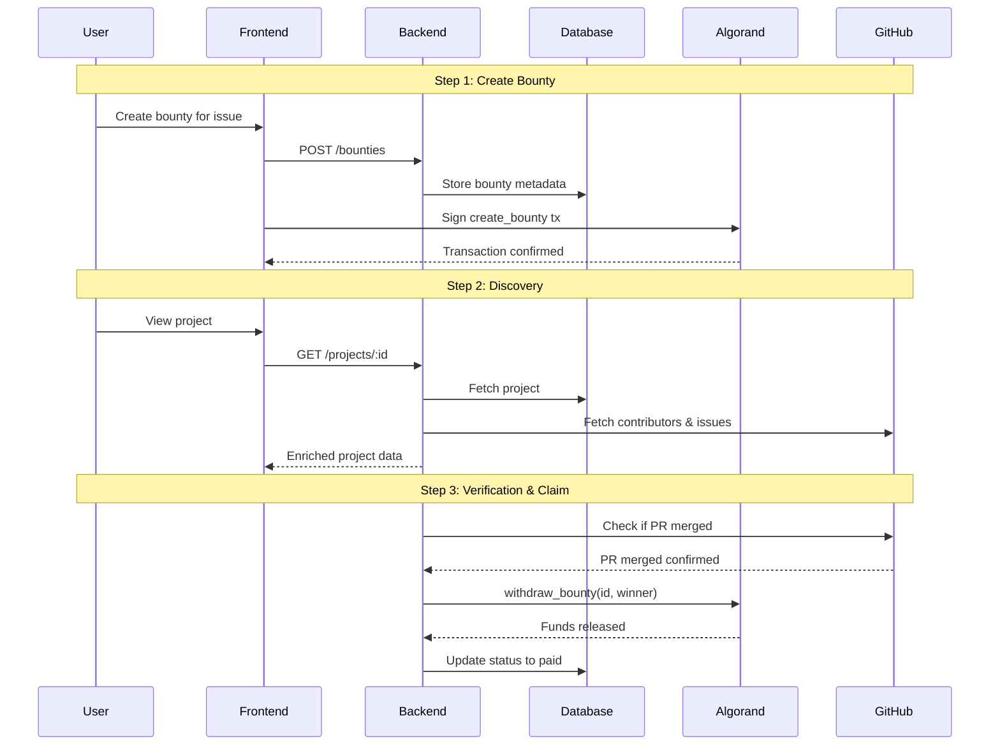
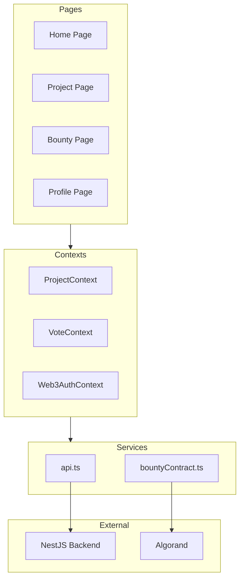
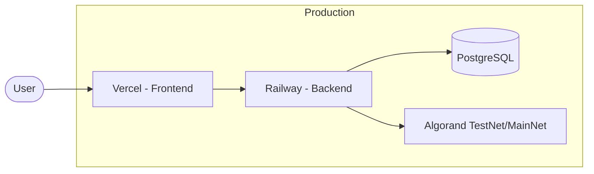
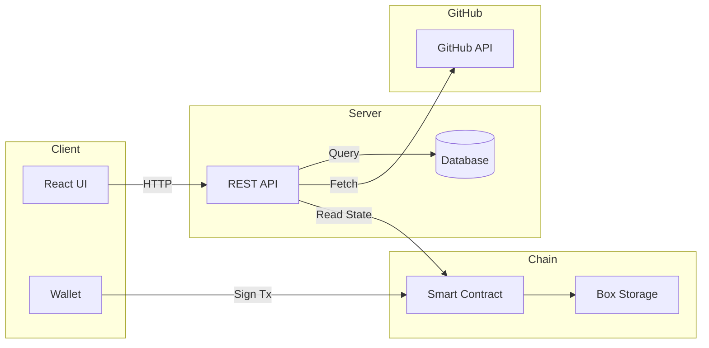

# WeSource - Capstone Project Milestone 2

**Project:** WeSource - Decentralized Open Source Bounty Platform  
**Student:** Arthur Rabelo  
**Date:** February 2026  
**Repository:** [github.com/p2arthur/WeSource_monorepo](https://github.com/p2arthur/WeSource_monorepo)

---

## Table of Contents

1. [Executive Summary](#1-executive-summary)
2. [High-Level Architecture](#2-high-level-architecture)
3. [Frontend-Backend Interaction](#3-frontend-backend-interaction)
4. [Database Schema Design](#4-database-schema-design)
5. [CRUD Operations](#5-crud-operations)
6. [API Contract](#6-api-contract)
7. [Smart Contract Interface](#7-smart-contract-interface)
8. [Authorization & Security](#8-authorization--security)
9. [Deployment Architecture](#9-deployment-architecture)
10. [Appendix: Mermaid Diagrams](#appendix-mermaid-diagrams)

---

## 1. Executive Summary

WeSource is a decentralized bounty platform that connects open-source project maintainers with contributors through cryptocurrency-backed rewards on the Algorand blockchain. The platform enables:

- **Project Owners** to create bounties for GitHub issues
- **Contributors** to discover and work on bounties
- **Automated Verification** of completed work via GitHub API
- **Secure Escrow** of funds using Algorand smart contracts

### Key Features

| Feature              | Description                                                                  |
| -------------------- | ---------------------------------------------------------------------------- |
| Bounty Creation      | Fund GitHub issues with USDC (or other cryptocurrencies in the future)       |
| Escrow System        | Smart contract holds funds until work is verified (claimable by contributor) |
| GitHub Integration   | Automatic detection of merged PRs                                            |
| Multi-Wallet Support | Web3Auth for GitHub login + Algorand wallets (Pera, Defly)                   |
| Transparent Payments | All transactions recorded on-chain                                           |

---

## 2. High-Level Architecture

### 2.1 System Overview

```
┌─────────────────────────────────────────────────────────────────────────┐
│                           WeSource Platform                              │
├─────────────────────────────────────────────────────────────────────────┤
│                                                                          │
│   ┌────────────┐      ┌────────────┐      ┌────────────────────────┐    │
│   │   React    │      │   NestJS   │      │   Algorand Blockchain  │    │
│   │  Frontend  │◀────▶│  Backend   │◀────▶│   (Smart Contracts)    │    │
│   └────────────┘      └────────────┘      └────────────────────────┘    │
│         │                   │                        │                   │
│         ▼                   ▼                        ▼                   │
│   ┌────────────┐      ┌────────────┐      ┌────────────────────────┐    │
│   │  Web3Auth  │      │ PostgreSQL │      │    Algorand Indexer    │    │
│   │  Wallets   │      │  Database  │      │  (Transaction History) │    │
│   └────────────┘      └────────────┘      └────────────────────────┘    │
│                             │                                            │
│                             ▼                                            │
│                       ┌────────────┐                                     │
│                       │ GitHub API │                                     │
│                       └────────────┘                                     │
└─────────────────────────────────────────────────────────────────────────┘
```

### 2.2 Technology Stack

| Layer      | Technology                | Purpose                  |
| ---------- | ------------------------- | ------------------------ |
| Frontend   | React + Vite + TypeScript | Single Page Application  |
| Styling    | Tailwind CSS              | UI Framework             |
| Wallet     | use-wallet + Web3Auth     | Multi-wallet support     |
| Backend    | NestJS + TypeScript       | REST API                 |
| Database   | PostgreSQL + Prisma ORM   | Data persistence         |
| Blockchain | Algorand (PuyaTs)         | Smart contracts & escrow |
| External   | GitHub API                | Repository & issue data  |

---

## 3. Frontend-Backend Interaction

### 3.1 Frontend Components

| Component Type | Examples                                     | Purpose                    |
| -------------- | -------------------------------------------- | -------------------------- |
| Pages          | Home, Project, Bounty, Profile               | Main route views           |
| Components     | BountyCard, ProjectCard, Modals              | Reusable UI elements       |
| Contexts       | ProjectContext, VoteContext, Web3AuthContext | Global state               |
| Services       | api.ts, bountyContract.ts                    | Backend & blockchain calls |

### 3.2 Backend Modules

| Module         | Purpose                                       |
| -------------- | --------------------------------------------- |
| ProjectsModule | Project CRUD operations                       |
| BountiesModule | Bounty management & on-chain sync             |
| GithubModule   | GitHub API integration (contributors, issues) |
| AlgorandModule | Blockchain operations (read state, withdraw)  |
| PrismaModule   | Database access layer                         |

### 3.3 Data Flow

1. **User creates bounty** → Frontend calls backend → Backend records in DB → User signs on-chain transaction
2. **User views project** → Backend fetches from DB + live GitHub data → Returns enriched response
3. **Bounty claimed** → Backend verifies PR merged via GitHub → Triggers on-chain withdrawal

---

## 4. Database Schema Design

### 4.1 Entity-Relationship Diagram

```
┌─────────────────────┐          ┌─────────────────────┐
│      PROJECT        │          │     REPOSITORY      │
├─────────────────────┤          ├─────────────────────┤
│ id (PK)             │──────┐   │ id (PK)             │
│ name                │      │   │ githubUrl (UNIQUE)  │
│ description         │      └──▶│ projectId (FK)      │
│ category            │          │ createdAt           │
│ creator             │          │ updatedAt           │
│ createdAt           │          └─────────────────────┘
│ updatedAt           │
└─────────────────────┘

┌─────────────────────┐
│       BOUNTY        │
├─────────────────────┤
│ id (PK)             │
│ bountyKey (UNIQUE)  │◀─── Deterministic hash for on-chain lookup
│ repoOwner           │
│ repoName            │
│ issueNumber         │
│ issueUrl            │
│ amount (microAlgos) │
│ creatorWallet       │
│ status              │◀─── open | claimable | paid
│ winnerId            │
│ createdAt           │
│ updatedAt           │
└─────────────────────┘
```

### 4.2 Data Storage Strategy

| Data                        | Storage              | Reason                        |
| --------------------------- | -------------------- | ----------------------------- |
| Project/Repository metadata | PostgreSQL           | Persistent, queryable         |
| Bounty metadata             | PostgreSQL           | Quick access, status tracking |
| Contributors & Issues       | GitHub API (live)    | Always current                |
| Bounty funds                | Algorand Box Storage | Secure escrow                 |
| Payment records             | Algorand Box Storage | Immutable on-chain            |

---

## 5. CRUD Operations

| Entity     | Create               | Read                             | Update                  | Delete               |
| ---------- | -------------------- | -------------------------------- | ----------------------- | -------------------- |
| Project    | POST /projects       | GET /projects, GET /projects/:id | —                       | DELETE /projects/:id |
| Repository | Created with Project | Included in Project              | —                       | Cascade deleted      |
| Bounty     | POST /bounties       | GET /bounties, GET /bounties/:id | PATCH (internal status) | — (funds locked)     |

---

## 6. API Contract

### 6.1 Endpoints Overview

| Method | Endpoint      | Description                       |
| ------ | ------------- | --------------------------------- |
| POST   | /projects     | Create project with GitHub repos  |
| GET    | /projects     | List all projects                 |
| GET    | /projects/:id | Get project with live GitHub data |
| DELETE | /projects/:id | Delete project (cascade)          |
| POST   | /bounties     | Create bounty for GitHub issue    |
| GET    | /bounties     | List all bounties                 |
| GET    | /bounties/:id | Get bounty with on-chain state    |

### 6.2 Key Request/Response Formats

**Create Project:**

- Request: `{ name, description, category, creator, repoUrls[] }`
- Response: `{ id, name, description, category, creator, repositories[], timestamps }`

**Create Bounty:**

- Request: `{ repoOwner, repoName, issueNumber, amount, creatorWallet }`
- Response: `{ id, bountyKey, issueUrl, amount, status, timestamps }`

**Get Project (with GitHub data):**

- Response: `{ id, name, repositories[{ githubUrl, contributors[], issues[] }] }`

### 6.3 Error Responses

| Code | Meaning            |
| ---- | ------------------ |
| 400  | Invalid input      |
| 404  | Resource not found |
| 429  | GitHub rate limit  |
| 500  | Server error       |

---

## 7. Smart Contract Interface

### 7.1 SourceFactory Contract Methods

| Method          | Parameters              | Description                        |
| --------------- | ----------------------- | ---------------------------------- |
| bootstrap       | —                       | Initialize contract (manager only) |
| create_bounty   | bountyId, bountyValue   | Create escrow for bounty           |
| withdraw_bounty | bountyId, winnerAddress | Release funds (manager only)       |

### 7.2 On-Chain State

| Storage      | Contents                                         |
| ------------ | ------------------------------------------------ |
| Global State | Manager address, total bounties count            |
| Box Storage  | Bounty data (value, paid status, winner address) |

---

## 8. Authorization & Security

| Aspect              | Implementation                  |
| ------------------- | ------------------------------- |
| API Auth            | Public endpoints (MVP)          |
| Wallet Verification | Client provides address         |
| Withdrawal Control  | Backend manager wallet only     |
| On-Chain Validation | Smart contract verifies manager |

---

## 9. Deployment Architecture

```
┌─────────────────────────────────────────────────────────┐
│                   Production Stack                       │
├─────────────────────────────────────────────────────────┤
│  Vercel (Frontend) ──▶ Railway (Backend + PostgreSQL)   │
│                              │                           │
│                              ▼                           │
│                     Algorand TestNet/MainNet             │
└─────────────────────────────────────────────────────────┘
```

---

## Appendix: Mermaid Diagrams

### A.1 System Architecture



### A.2 Entity-Relationship Diagram



### A.3 Bounty Lifecycle Flow



### A.4 Component Architecture



### A.5 Deployment Architecture



### A.6 Data Flow Overview



---

_Document generated for CCTB Capstone Project - Milestone 2_
