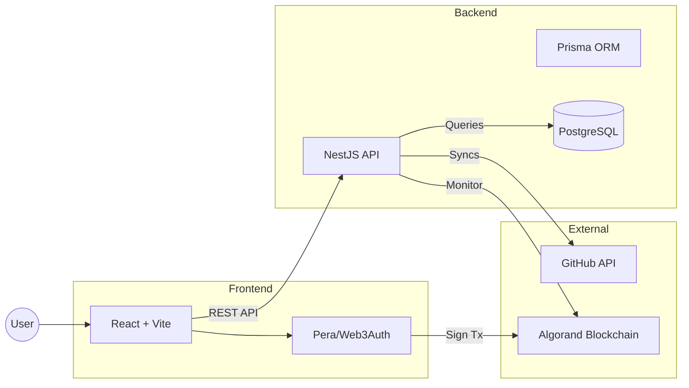
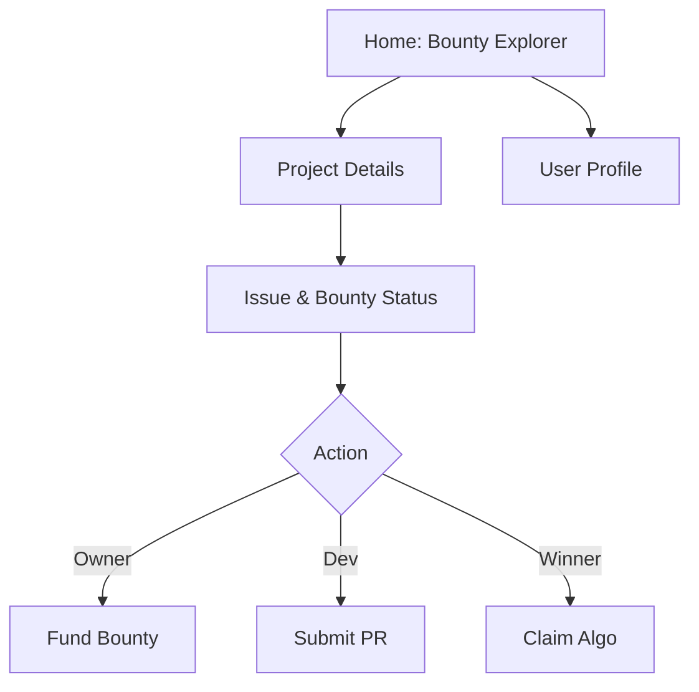
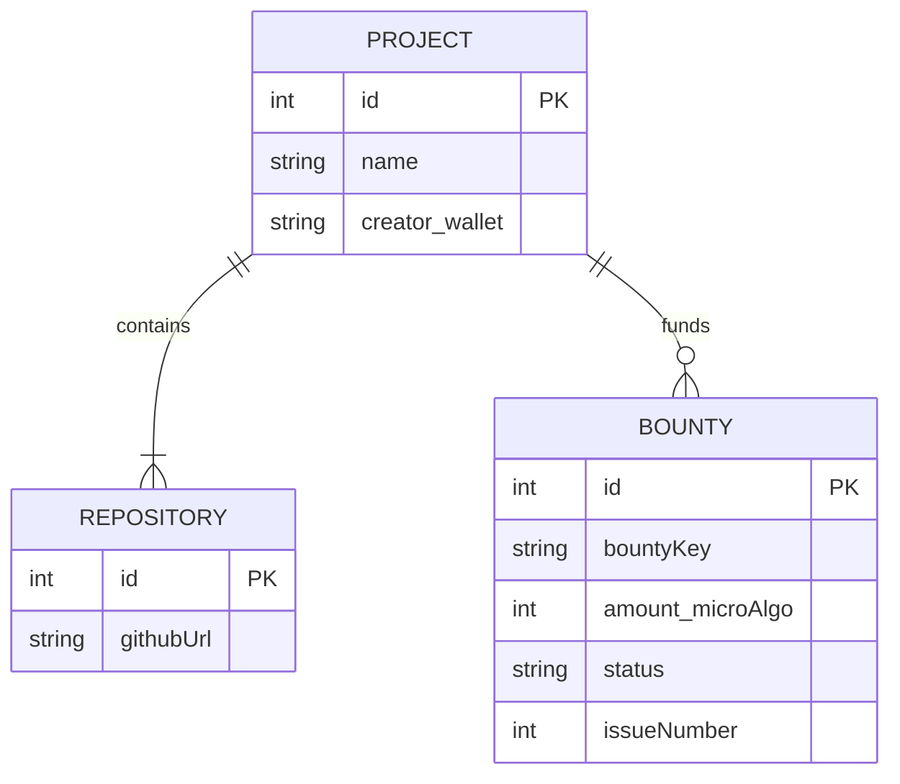

# WeSource: Capstone Project Milestone 2

Decentralized Open Source Bounty Platform  
Student: Arthur Rabelo  
Date: February 2026  
Repository: github.com/p2arthur/WeSource_monorepo

## 1. Executive Summary

**The Problem:** Open-source maintainers struggle to incentivize contributions, and contributors often wait weeks for payment or recognition.  
**The Solution:** WeSource connects GitHub issues with Algorand smart contracts.

**Key Capabilities**

- Project Owners: Fund GitHub issues using ALGO.
- Contributors: Solve issues and get paid instantly upon PR merge.
- Trustless Escrow: Smart contracts hold funds; no middleman.
- Verification: Automated via GitHub API.

## 2. High-Level Architecture

WeSource utilizes a hybrid Web2 (Metadata) + Web3 (Payments) architecture.



## 3. Frontend-Backend Interaction

The interaction model separates financial state (Blockchain) from application state (Database).

| Layer      | Technology                   | Responsibility                                                |
| ---------- | ---------------------------- | ------------------------------------------------------------- |
| Frontend   | React, Tailwind, Context API | UI, wallet signing, state management.                         |
| Backend    | NestJS, Prisma               | Business logic, GitHub synchronization, transaction indexing. |
| Database   | PostgreSQL                   | Project metadata, bounty tracking, user profiles.             |
| Blockchain | Algorand (PuyaTs)            | Escrow logic (create, withdraw), payment history.             |

## 4. UI/UX Strategy & Wireframes

**Design Goal:** A "code-first" dark mode interface focusing on data density and developer ergonomics.

**Key Pages Structure**



**Design References**

- We aim for the clean data visualization found in DeFi dashboards.
- Reference 1: Crypto Dashboard by Aurelien Salomon (clean table layouts). Source: Dribbble.
- Reference 2: DevTool Dark Mode UI (code-centric typography). Source: Behance.

## 5. Database Schema Design

We track application data off-chain to minimize storage costs and maximize query speed.

**ER Diagram**



**Key Entities**

- Project: Aggregates multiple repos (monorepo support).
- Bounty: Links a GitHub Issue ID to an Algorand escrow ID.
- Repository: Stores GitHub URLs for API polling.

## 6. CRUD Operations & API

**Core Operations**

| Entity  | Operation | Endpoint        | Description                                  |
| ------- | --------- | --------------- | -------------------------------------------- |
| Project | POST      | `/projects`     | Create project & link GitHub repos.          |
| Project | GET       | `/projects/:id` | Fetch project + live GitHub issue data.      |
| Bounty  | POST      | `/bounties`     | Create bounty record after on-chain funding. |
| Bounty  | PATCH     | `/bounties/:id` | Update status (Open -> Paid).                |

**API Contract Example (Create Bounty)**

Request: `POST /bounties`

```json
{
  "repoOwner": "p2arthur",
  "repoName": "WeSource",
  "issueNumber": 42,
  "amount": 10000000,
  "creatorWallet": "ABCD..."
}
```

**Authorization**

- Public: Read operations (GET).
- Protected: Write operations require wallet signature or Web3Auth JWT.

## 7. Technology Stack Summary

We leverage a fully typed, modern stack for reliability and speed.

| Domain     | Tech                                      |
| ---------- | ----------------------------------------- |
| Frontend   | React 18, Vite, Tailwind CSS, use-wallet  |
| Backend    | NestJS (Node.js), Prisma ORM              |
| Database   | PostgreSQL (Production), SQLite (Dev)     |
| Blockchain | Algorand (AVM), PuyaTs                    |
| Auth       | Web3Auth (Social Login), WalletConnect    |
| DevOps     | GitHub Actions, Vercel (FE), Railway (BE) |

## Thank You!

**Next Steps for Milestone 3**

- Implement Web3Auth JWT validation on backend.
- Deploy smart contracts to Algorand Testnet.
- Finalize "Claim" logic with oracle cron jobs.

Questions?
