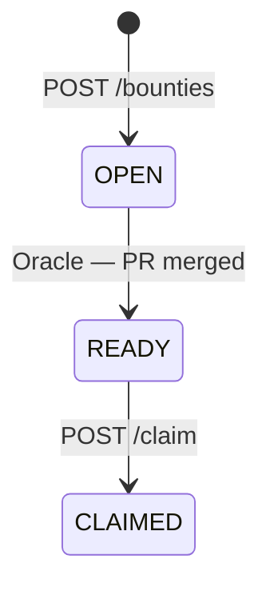
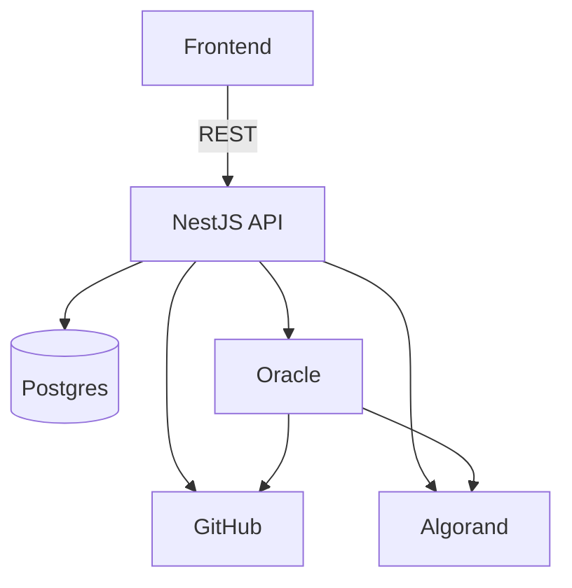

# WeSource

**Backend Development Milestone**

Decentralized Open Source Bounty Platform

<div class="abs-br m-6 text-xl opacity-60">
  Arthur Rabelo · March 2026
</div>

---

## transition: fade-out

# Agenda

<div class="grid grid-cols-2 gap-8 mt-10">

<div v-click>

### What I Built — Backend

- Set Up Backend Server
- Integrate the Database
- Develop API Routes
- x402 experiments & Agentic Work
- Authentication (Web3Auth) — GitHub → Algorand wallet

</div>

<div v-click>

### Tech Stack

- **Runtime:** Node.js + NestJS
- **ORM:** Prisma
- **Database:** PostgreSQL
- **Docs:** Swagger UI
- **Payments:** x402 on Algorand

</div>

</div>

---

# 1. Set Up Backend Server

**Node.js + NestJS** — structured, production-ready framework

```ts {all|3-4|6-7|9-13|15}
async function bootstrap() {
  const app = await NestFactory.create(AppModule);
  app.enableCors();

  // Optional: gates POST /api/bounties behind USDC payment
  if (process.env.AVM_ADDRESS) app.use(createX402Middleware());

  app.useGlobalPipes(
    new ValidationPipe({
      whitelist: true,
      forbidNonWhitelisted: true,
      transform: true,
    }),
  );

  await app.listen(3000);
}
```

---

# 1. Module Structure

NestJS organizes the app into **feature modules**, each self-contained

<div class="grid grid-cols-2 gap-8 mt-6">

<div v-click class="border border-green-500 rounded p-4">

### Modules

- `AppModule` — root, wires everything together
- `ProjectsModule` — project & repo management
- `BountiesModule` — bounty CRUD + on-chain sync
- `GithubModule` — REST & GraphQL integration
- `OracleModule` — PR merge detection

</div>

<div v-click class="border border-blue-500 rounded p-4">

### Key Middleware

- **CORS** — allows the React frontend during dev
- **x402** _(optional)_ — HTTP 402 gate on `POST /api/bounties`, only active when `AVM_ADDRESS` is set
- **ValidationPipe** — validates all DTOs automatically

</div>

</div>

---

# 2. Database Schema

**PostgreSQL** · **SQLite** (dev) — managed via **Prisma ORM**

```prisma {all|1-9|11-15|17-26}
model Project {
  id           Int          @id @default(autoincrement())
  name         String
  description  String?
  category     String?
  creator      String
  repositories Repository[]
  bounties     Bounty[]
}

model Repository {
  id        Int     @id @default(autoincrement())
  githubUrl String
  projectId Int
  project   Project @relation(fields: [projectId], references: [id])
}
```

---

#2. Bounty

```prisma {all|1-9|11-15|17-26}
model Bounty {
  id           Int     @id @default(autoincrement())
  bountyKey    String  @unique #hashes repo creator + issue number - unique key for the smart contract
  amount       BigInt
  status       String  @default("OPEN")
  issueNumber  Int
  repoOwner    String
  repoName     String
  winnerGithub String?
}
```

---

# 2. Why Prisma & Docker

<div class="grid grid-cols-2 gap-8 mt-6">

<div v-click class="border border-purple-500 rounded p-4">

### Three Core Entities

- **Project** — groups repos and bounties
- **Repository** — stores GitHub URLs for polling
- **Bounty** — links a GitHub issue to an Algorand escrow

</div>

<div v-click class="border border-yellow-500 rounded p-4">

### Why Prisma?

- Fully **type-safe** queries — no raw SQL
- `prisma migrate dev` applies migrations automatically
- Works with **SQLite** locally, **PostgreSQL** in prod

</div>

</div>

<div v-click class="border border-red-400 rounded p-4 mt-6">

### Docker Compose — one command starts everything

```bash
docker-compose up
```

</div>

---

# 3. API Routes — Overview

`Controller → Service → Prisma` — HTTP handling, business logic, and data access always separated

<div class="grid grid-cols-3 gap-6 mt-8">

<div v-click class="border border-blue-400 rounded p-4">

### ProjectsModule

- `POST /api/projects`
- `GET /api/projects`
- `GET /api/projects/:id`

Live GitHub issues fetched on every request

</div>

<div v-click class="border border-green-400 rounded p-4">

### BountiesModule

- `POST /api/bounties`
- `GET /api/bounties`
- `GET /api/bounties/winner/:username`
- `POST /api/bounties/claim`
- `POST /api/bounties/sync`

</div>

<div v-click class="border border-yellow-400 rounded p-4">

### OracleModule

- `POST /oracle/validate`
- `GET /oracle/status`

Autonomous — runs on demand or via cron

</div>

</div>

---

# 3. ProjectsModule — Endpoints

Manages projects and their linked GitHub repositories

<div class="grid grid-cols-2 gap-8 mt-6">

<div>

<div class="text-sm mt-2">

| Method | Endpoint            | Description                  |
| ------ | ------------------- | ---------------------------- |
| `POST` | `/api/projects`     | Create project + link repos  |
| `GET`  | `/api/projects`     | List all projects            |
| `GET`  | `/api/projects/:id` | Project + live GitHub issues |

</div>

</div>

<div>

<div v-click class="border border-blue-400 rounded p-4 text-sm">

### How `GET /api/projects/:id` works

1. Load project + linked repos from DB
2. For each repo, call **GithubModule**
3. Fetch live open issues, labels, contributors via GraphQL
4. Merge and return as a single response

No caching — always fresh from GitHub.

</div>

</div>

</div>

---

# 3. BountiesModule — Endpoints

Full bounty lifecycle, optionally gated by an x402 USDC payment

<div class="grid grid-cols-2 gap-8 mt-4">

<div class="text-sm">

| Method | Endpoint                  | Description                     |
| ------ | ------------------------- | ------------------------------- |
| `POST` | `/api/bounties`           | Create bounty _(x402 optional)_ |
| `GET`  | `/api/bounties`           | List all bounties               |
| `GET`  | `/api/bounties/winner/:u` | Bounties won by user            |
| `POST` | `/api/bounties/claim`     | Claim on-chain reward           |
| `POST` | `/api/bounties/sync`      | Sync DB ↔ on-chain state        |

</div>

<div v-click>



</div>

</div>

---

# 3. OracleModule — Endpoints

Autonomous service that keeps bounty state in sync with GitHub

<div class="grid grid-cols-2 gap-8 mt-6">

<div>

<div class="text-sm mt-2">

| Method | Endpoint           | Description                   |
| ------ | ------------------ | ----------------------------- |
| `POST` | `/oracle/validate` | Check open bounties vs GitHub |
| `GET`  | `/oracle/status`   | Service health check          |

</div>

</div>

<div>

<div v-click class="border border-yellow-400 rounded p-4 text-sm">

### How `/oracle/validate` works

1. Fetch all `OPEN` bounties from DB
2. For each — check if its GitHub issue was closed
3. If closed by a merged PR → set status `READY_FOR_CLAIM`
4. Record the PR author's Algorand wallet address
5. Return a sync report `{ checked, updated, errors }`

</div>

</div>

</div>

---

# 4. GithubModule & Swagger UI

<div class="grid grid-cols-2 gap-8 mt-6">

<div v-click class="border border-purple-500 rounded p-4">

### GithubModule

Pure service — **no HTTP routes**. Used internally by ProjectsModule and OracleModule.

- Parses GitHub URLs → `owner/repo`
- Fetches open issues, labels, contributors
- Detects which PR closed an issue + the PR author

</div>

<div v-click class="border border-blue-500 rounded p-4">

### Swagger UI

Auto-generated docs from NestJS decorators — always in sync with the code.

```ts
SwaggerModule.setup("api", app, SwaggerModule.createDocument(app, config));
```

Live at `localhost:3000/api` — every endpoint has request/response schemas, testable in browser.

</div>

</div>

# Authentication — Web3Auth

Users log in with **GitHub** — no crypto wallet needed

<div class="grid grid-cols-2 gap-8 mt-4">

<div>

```ts {all|3|6|9-10|13-15}
async function getAlgorandAccount(provider) {
  // 1. Private key derived from social identity
  const privKey = await provider.request({ method: "private_key" });

  // 2. First 32 bytes as seed
  const seed = new Uint8Array(Buffer.from(privKey, "hex")).slice(0, 32);

  // 3. Derive Algorand key pair
  const mnemonic = algosdk.mnemonicFromSeed(seed);
  const account = algosdk.mnemonicToSecretKey(mnemonic);

  // 4. Return deterministic Algorand address
  return {
    address: String(account.addr),
    secretKey: account.sk,
  };
}
```

</div>

<div>

<v-clicks>

- **Deterministic** — same GitHub identity → same wallet, every time
- **Non-custodial** — Web3Auth never holds the key
- **No wallet setup** — no MetaMask, no seed phrase

### Flow

1. GitHub OAuth login
2. Web3Auth derives a private key
3. Converted to Algorand address
4. Oracle stores address when PR is merged
5. Smart contract pays **only that address**

</v-clicks>

</div>

</div>

---

# Summary

<div class="grid grid-cols-2 gap-8 mt-4">

<div>

<v-clicks>

### What Was Delivered

- **NestJS server** — modular, production-ready
- **PostgreSQL** via Prisma — type-safe, Docker Compose
- **10 REST endpoints** across 4 feature modules
- **Swagger UI** — live interactive docs at `/api`
- **x402** — optional on-chain payment gate
- **Web3Auth** — GitHub login → deterministic Algorand wallet

</v-clicks>

</div>

<div v-click>



</div>

</div>

---

layout: center
class: text-center

---

# Thank You

**WeSource** — Empowering Open Source Sustainability

<div class="mt-8 opacity-70">
  Arthur Rabelo · CCTB FSW Capstone · March 2026
</div>
